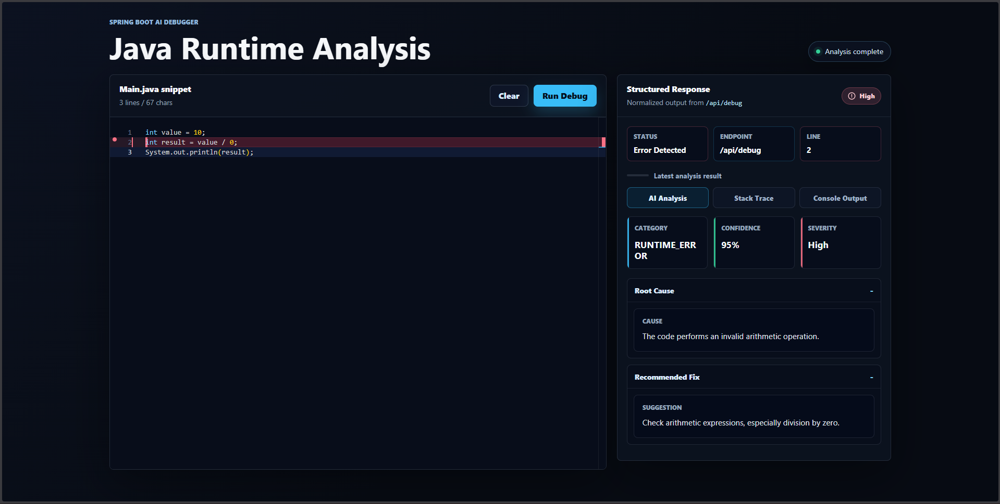
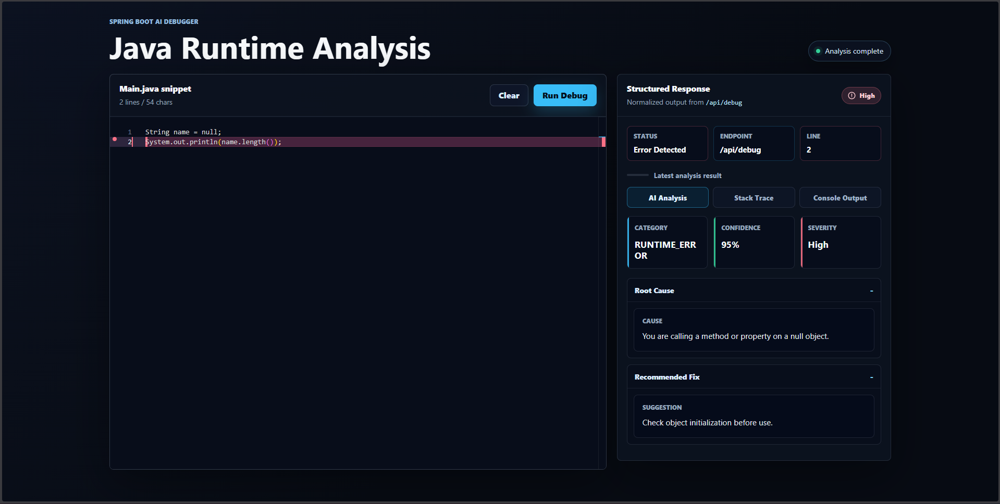
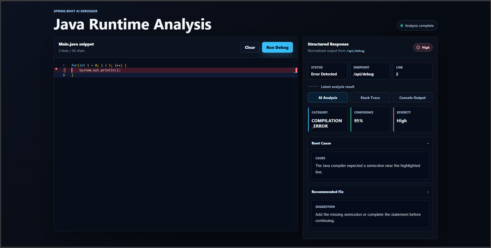
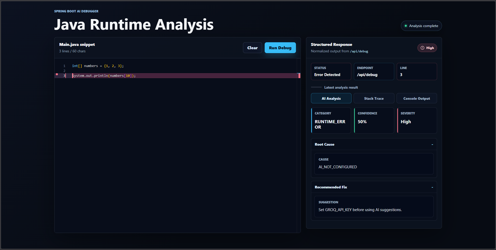

# AI Debugging Assistant

AI Debugging Assistant is a full-stack Java debugging tool built with Spring Boot and React. It accepts Java snippets or diagnostics, executes code in a controlled backend workflow, classifies compile-time and runtime errors, and returns structured debugging guidance for a professional developer workflow.

## Highlights

- Java code editor powered by Monaco Editor
- Spring Boot API for code execution and diagnostic analysis
- Deterministic handlers for common runtime and compile-time failures
- AI fallback for unknown diagnostics
- Structured responses with category, severity, confidence, and line number
- Error-line highlighting in the frontend
- Timeout protection for infinite loops
- Basic safety policy to block dangerous code execution patterns
- Docker setup for local deployment

## Screenshots

### Runtime Error Detection


### Null Pointer Exception Detection


### Compilation Error Detection


### Array Index Out Of Bounds Detection


## Architecture

```text
React Frontend
  Monaco Editor
  Debug panels
  Structured response UI
        |
        | POST /api/debug
        v
Spring Boot Backend
  DebugController
        |
  DebugService
  - orchestrates request flow
  - delegates execution/parsing/handling
        |
  CodeExecutor
  - wraps Java snippets
  - compiles with javac
  - runs with timeout
  - applies safety policy
        |
  ErrorParser + ExecutionResult
  - extracts status, diagnostic type, exception type, line number
        |
  DebugHandler implementations
  - deterministic runtime and compile-time guidance
        |
  AIService fallback
  - optional Groq-backed explanation for unknown cases
```

### Backend Design

- `DebugController` exposes the REST endpoint.
- `DebugService` is the orchestration layer only.
- `CodeExecutor` owns compile/run behavior and timeout protection.
- `ErrorParser` converts compiler output and stack traces into structured `ExecutionResult` objects.
- `DebugHandler` implementations provide deterministic responses for known errors.
- `AIService` is used only when deterministic handling cannot resolve the diagnostic.

### Frontend Design

- React + Vite app located in `frontend/`.
- Monaco Editor provides Java editing and error-line highlighting.
- Debug panels separate AI Analysis, Stack Trace, and Console Output.
- Vite dev proxy forwards `/api` to `localhost:8080`.

## Project Structure

```text
.
|-- src/main/java/com/yash/backend
|   |-- DebugController.java
|   |-- DebugService.java
|   |-- DebugResponseNormalizer.java
|   |-- ai/
|   |-- executor/
|   `-- handler/
|-- src/test/java/com/yash/backend
|-- frontend/
|   |-- src/
|   |-- package.json
|   `-- vite.config.js
|-- docs/screenshots/
|-- Dockerfile
|-- docker-compose.yml
`-- README.md
```

## Prerequisites

- Java 17
- Maven wrapper included through `mvnw` / `mvnw.cmd`
- Node.js 20+ for frontend development
- Docker Desktop, optional
- `GROQ_API_KEY`, optional for AI fallback

## Local Setup

### 1. Run Backend

Windows:

```powershell
$env:GROQ_API_KEY="your_key_here"
.\mvnw.cmd spring-boot:run
```

macOS/Linux:

```bash
export GROQ_API_KEY="your_key_here"
./mvnw spring-boot:run
```

Backend runs at:

```text
http://localhost:8080
```

If no API key is configured, deterministic local handlers still work. AI fallback responses will report that AI is not configured.

### 2. Run Frontend

```bash
cd frontend
npm install
npm run dev
```

Frontend runs at:

```text
http://127.0.0.1:5173
```

The frontend calls `/api/debug`, and Vite proxies that request to `http://localhost:8080`.

## Run Tests

```bash
./mvnw test
```

Windows:

```powershell
.\mvnw.cmd test
```

Current coverage includes service routing, code execution, compile-time diagnostics, runtime handlers, safety checks, and parser behavior.

## API Examples

### Analyze Java Code

```http
POST /api/debug
Content-Type: application/json
```

```json
{
  "code": "int value = 10;\nint result = value / 0;\nSystem.out.println(result);"
}
```

Example response:

```json
{
  "cause": "The code performs an invalid arithmetic operation.",
  "suggestion": "Check arithmetic expressions, especially division by zero.",
  "confidence": 95,
  "severity": "HIGH",
  "category": "RUNTIME_ERROR",
  "lineNumber": 2
}
```

### Analyze Existing Stack Trace

```json
{
  "stackTrace": "java.lang.NullPointerException: Cannot invoke method\n\tat Example.main(Example.java:12)"
}
```

Example response:

```json
{
  "cause": "You are calling a method or property on a null object.",
  "suggestion": "Check object initialization before use.",
  "confidence": 95,
  "severity": "HIGH",
  "category": "RUNTIME_ERROR",
  "lineNumber": 12
}
```

### Analyze Compile Error Text

```json
{
  "error": "Example.java:8: error: ';' expected"
}
```

Example response:

```json
{
  "cause": "The Java compiler expected a semicolon near the highlighted line.",
  "suggestion": "Add the missing semicolon or complete the statement before continuing.",
  "confidence": 95,
  "severity": "HIGH",
  "category": "COMPILATION_ERROR",
  "lineNumber": 8
}
```

## Docker Setup

### Build and Run Both Services

```bash
docker compose up --build
```

Services:

- Frontend: `http://localhost:5173`
- Backend: `http://localhost:8080`

With AI fallback:

```bash
GROQ_API_KEY=your_key_here docker compose up --build
```

On Windows PowerShell:

```powershell
$env:GROQ_API_KEY="your_key_here"
docker compose up --build
```

### Backend Only

```bash
docker build -t ai-debugger-backend .
docker run --rm -p 8080:8080 -e GROQ_API_KEY=your_key_here ai-debugger-backend
```

### Frontend Only

```bash
docker build -t ai-debugger-frontend ./frontend
docker run --rm -p 5173:80 ai-debugger-frontend
```

## Deployment Notes

Backend deployment:

- Use a JDK image, not a JRE image, because `CodeExecutor` invokes `javac`.
- Set `GROQ_API_KEY` as a secret or environment variable.
- Keep `ai.enabled=false` if deploying without AI fallback.
- Restrict public access if code execution is exposed outside trusted environments.

Frontend deployment:

- Build with `npm run build`.
- Serve `frontend/dist` through Nginx, Netlify, Vercel, or any static host.
- Configure `/api` routing to the backend service.

Production hardening to consider:

- Run code execution in a container or sandbox with CPU and memory limits.
- Add authentication and rate limiting.
- Add request size limits.
- Add centralized logging and metrics.
- Add CI checks for backend tests and frontend build.

## Future Improvements

- Isolated per-request execution sandbox
- More compile-time diagnostic handlers
- More runtime exception handlers
- Memory limits for executed Java snippets
- Persisted debugging history
- Downloadable debug reports
- CI/CD workflow for tests, builds, and Docker images
- Optional OpenAPI/Swagger documentation

## Interview Talking Points

- Clear separation between orchestration, execution, parsing, handling, and AI fallback
- Structured `ExecutionResult` avoids fragile string-based control flow
- Deterministic handlers preserve predictable behavior for common errors
- Timeout and safety policy reduce execution risk
- Frontend presents backend diagnostics in a developer-focused debugging workflow
- Docker setup demonstrates deployment readiness
